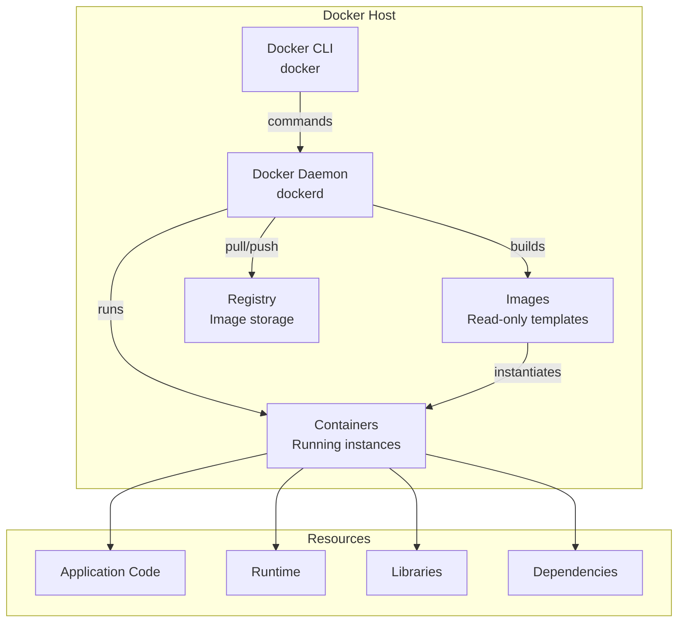

## What is Docker?

Docker is an open-source platform that enables the creation, deployment, and management of applications within lightweight, isolated containers. It provides a consistent and efficient way to package software and its dependencies, ensuring that applications run reliably across different computing environments.

<Callout kind="info" collapsed="false">
  Docker containers share the host OS kernel, making them more lightweight and efficient than traditional virtual machines.
</Callout>

### Docker Architecture



### Key Benefits

<Columns cols="2">
  <Card title="Portability" href="#" icon="package" horizontal="false">
    Run consistently across dev, test, and production. Eliminates "it works on my machine" problems.
  </Card>

  <Card title="Scalability" href="#" icon="trending-up" horizontal="false">
    Deploy multiple container instances quickly. Scale up or down based on demand.
  </Card>

  <Card title="Resource Efficiency" href="#" icon="zap" horizontal="false">
    Lightweight containers share host resources. Higher density than VMs.
  </Card>

  <Card title="Isolation" href="#" icon="shield" horizontal="false">
    Applications run independently. Enhanced security and no dependency conflicts.
  </Card>

  <Card title="Version Control" href="#" icon="git-commit" horizontal="false">
    Version-controlled images enable easy rollbacks and change tracking.
  </Card>

  <Card title="Rapid Deployment" href="#" icon="rocket" horizontal="false">
    Standardized environment reduces deployment time from hours to seconds.
  </Card>
</Columns>

### Docker Components

<ParamField path="dockerfile" param-type="file" required="true" deprecated="false">
  Text file containing instructions to build a Docker image. Each instruction creates a new layer.
</ParamField>

<ParamField path="image" param-type="artifact" required="true" deprecated="false">
  Read-only template containing application code, runtime, libraries, and dependencies. Used to create containers.
</ParamField>

<ParamField path="container" param-type="runtime" required="true" deprecated="false">
  Runnable instance of an image. Has a writable layer on top of the image for runtime changes.
</ParamField>

<ParamField path="registry" param-type="service" required="false" deprecated="false">
  Storage and distribution system for Docker images. Docker Hub is the default public registry.
</ParamField>

<ParamField path="docker-daemon" param-type="service" required="true" deprecated="false">
  Background service (dockerd) that manages Docker objects. Listens for API requests from CLI.
</ParamField>

## Installation & Configuration of Docker

To install Docker Engine on a new host machine, it is important to first set up the Docker repository. Once the repository is configured, you can proceed with installing and updating Docker using the repository.

### Set up the repository

It provide instructions to set up the necessary repository and prerequisites for installing the Docker engine based on the operating system (OS) in use.

<CodeGroup tag="BASH" label="setup repository">

```bash {{ title: 'Ubuntu/Debian' }}
sudo apt-get update
sudo apt-get install \
    ca-certificates \
    curl \
    gnupg \
    lsb-release
sudo mkdir -p /etc/apt/keyrings
curl -fsSL https://download.docker.com/linux/debian/gpg | sudo gpg --dearmor -o /etc/apt/keyrings/docker.gpg
echo \
    "deb [arch=$(dpkg --print-architecture) signed-by=/etc/apt/keyrings/docker.gpg] https://download.docker.com/linux/debian \
    $(lsb_release -cs) stable" | sudo tee /etc/apt/sources.list.d/docker.list > /dev/null
```

```bash {{ title: 'CentOS/RHEL' }}
sudo yum install -y yum-utils
sudo yum-config-manager \
          --add-repo \
          https://download.docker.com/linux/centos/docker-ce.repo
```
</CodeGroup>

<CodeGroup tag="BASH" label="Install Docker Engine">

```bash {{ title: 'Ubuntu/Debian' }}
  $ sudo apt-get update
  $ sudo apt-get install docker-ce docker-ce-cli containerd.io docker-compose-plugin
```

```bash {{ title: 'CentOS/RHEL' }}
  yum install docker-ce docker-ce-cli containerd.io docker-compose-plugin
```

</CodeGroup>