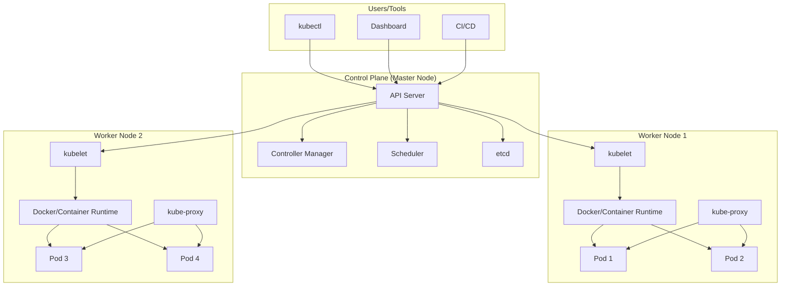
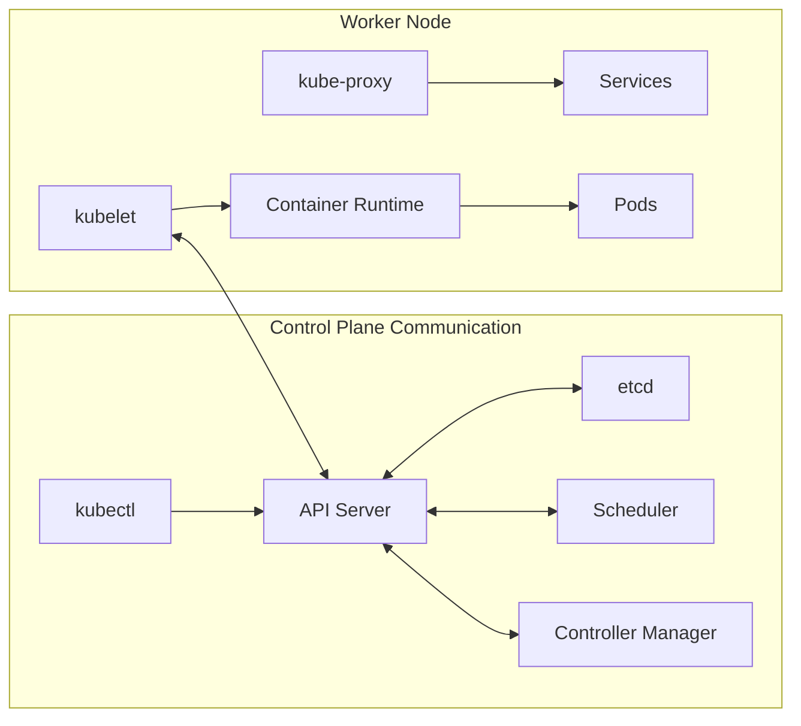
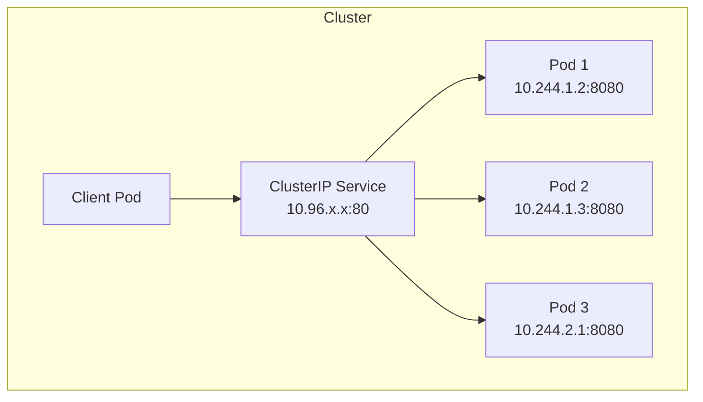
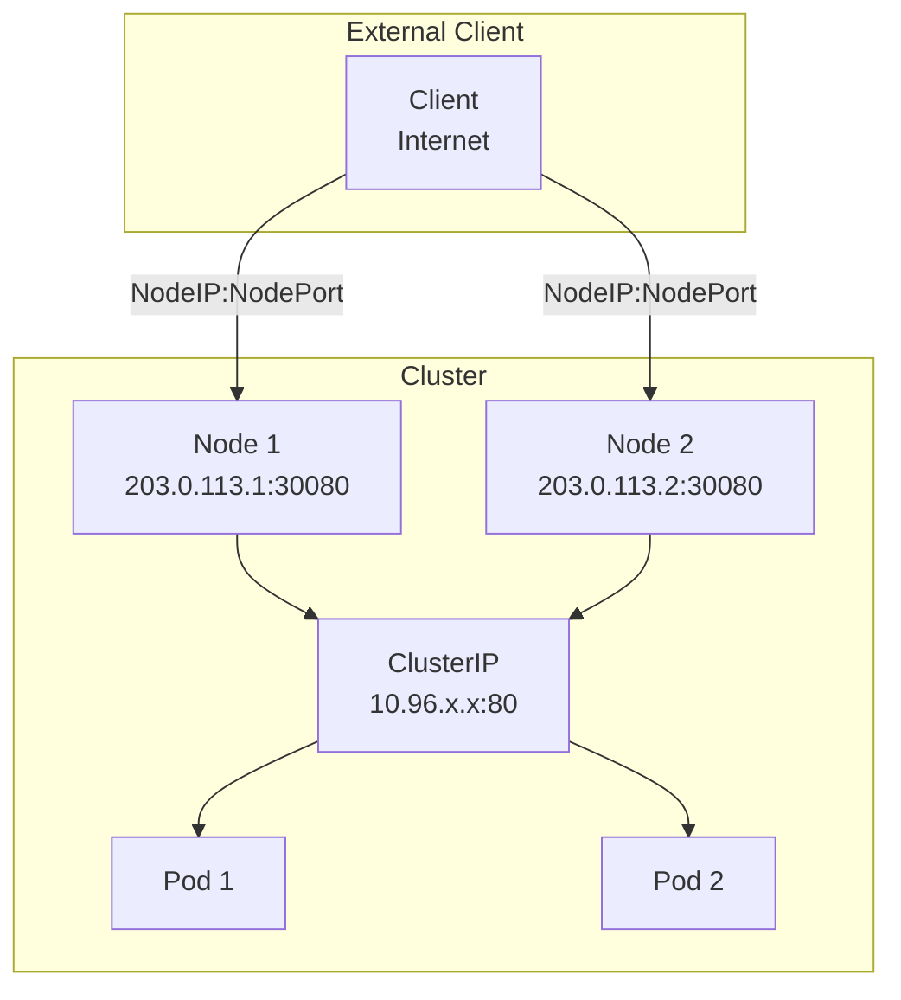
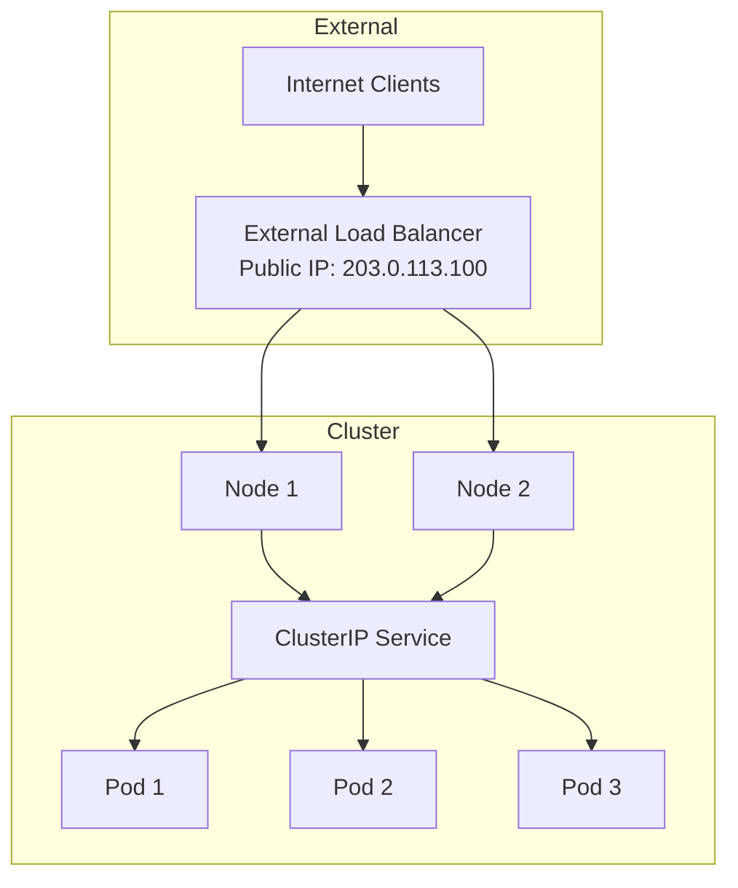

## Introduction

Kubernetes (also known as **k8s**) is an extensible, portable, and open-source container orchestration platform designed by Google. Kubernetes helps to manage containerized applications in various types of physical, virtual, and cloud environments.

Kubernetes helps you to control the resource allocation and traffic management for cloud applications and microservices. It also helps to simplify various aspects of service-oriented infrastructures. Kubernetes allows you to assure where and when containerized applications run and helps you to find resources and tools you want to work with.

<Callout kind="info" collapsed="false">
  The term "k8s" comes from abbreviating the 8 letters between "K" and "s" in "Kubernetes".
</Callout>

## Kubernetes Features

<Columns cols="2">
  <Card title="Automated Scheduling" href="#" icon="cpu" horizontal="false">
    Automatically places workloads on nodes based on resource requirements and constraints.
  </Card>

  <Card title="Self-Healing" href="#" icon="activity" horizontal="false">
    Restarts failed containers, replaces and reschedules pods when nodes die.
  </Card>

  <Card title="Rollouts & Rollback" href="#" icon="git-commit" horizontal="false">
    Automated deployment rollouts with automatic rollback on failure.
  </Card>

  <Card title="Scaling & Load Balancing" href="#" icon="trending-up" horizontal="false">
    Horizontal pod scaling and automatic load distribution across pods.
  </Card>

  <Card title="Environment Consistency" href="#" icon="box" horizontal="false">
    Same environment across development, testing, and production.
  </Card>

  <Card title="Resource Efficiency" href="#" icon="zap" horizontal="false">
    Higher density of resource utilization through intelligent bin-packing.
  </Card>

  <Card title="Loose Coupling" href="#" icon="layers" horizontal="false">
    Components act as separate units, enabling microservices architecture.
  </Card>

  <Card title="Enterprise Ready" href="#" icon="shield" horizontal="false">
    Built-in security, RBAC, secrets management, and production-grade features.
  </Card>
</Columns>

## Kubernetes Architecture



### Control Plane (Master Node) Components

The control plane is the brain of the Kubernetes cluster, responsible for management and administrative tasks. Multiple master nodes provide fault tolerance.

<ParamField path="api-server" param-type="service" required="true" deprecated="false">
  Central management hub that exposes Kubernetes API. All cluster operations are performed through the API server. Tools like kubectl and Dashboard communicate with it via REST APIs.
</ParamField>

<ParamField path="controller-manager" param-type="service" required="true" deprecated="false">
  Runs controller processes that regulate cluster state. Includes replication controller, endpoint controller, namespace controller, and service account controller. Works to match current state with desired state.
</ParamField>

<ParamField path="scheduler" param-type="service" required="true" deprecated="false">
  Assigns pods to available nodes based on resource requirements, constraints, and affinity/anti-affinity rules. Tracks node resource utilization for optimal placement.
</ParamField>

<ParamField path="etcd" param-type="database" required="true" deprecated="false">
  High-availability distributed key-value store for cluster configuration data. Stores all cluster state and metadata. Accessible only by API server for security.
</ParamField>

### Worker Node Components

Worker nodes run the actual application workloads. Each node contains services to manage containers, communicate with the control plane, and allocate resources.

<ParamField path="kubelet" param-type="agent" required="true" deprecated="false">
  Primary node agent that communicates with the control plane. Ensures containers are running in pods as specified. Manages pod lifecycle, health checks, and resource allocation.
</ParamField>

<ParamField path="kube-proxy" param-type="network" required="true" deprecated="false">
  Network proxy running on each node. Maintains network rules for pod-to-pod and external communication. Handles service IP translation and basic load balancing.
</ParamField>

<ParamField path="container-runtime" param-type="runtime" required="true" deprecated="false">
  Software responsible for running containers (Docker, containerd, CRI-O). Pulls images and manages container lifecycle on the node.
</ParamField>



Kubernetes Key Terminologies
============================

Cluster:
--------

It is a collection of hosts(servers) that helps you to aggregate their
available resources. That includes ram, CPU, ram, disk, and their
devices into a usable pool.

Master:
-------

The master is a collection of components which make up the control panel
of Kubernetes. These components are used for all cluster decisions. It
includes both scheduling and responding to cluster events.

Node:
-----

A node is a working machine in Kubernetes cluster . They are working
units which can be physical, VM, or a cloud instance.Each node has all
the required configuration required to run a pod on it such as the proxy
service and kubelet service along with the Docker, which is used to run
the Docker containers on the pod created on the node.

Namespace:
----------

It is a logical cluster or environment. It is a widely used method which
is used for scoping access or dividing a cluster. It provides an
additional qualification to a resource name. This is helpful when
multiple teams are using the same cluster and there is a potential of
name collision. It can be as a virtual wall between multiple clusters.

Following are some of the important functionalities of a Namespace in
Kubernetes

-   Namespaces help pod-to-pod communication using the same namespace.
-   Namespaces are virtual clusters that can sit on top of the same
    physical cluster.
-   They provide logical separation between the teams and their
    environments.

```yaml
apiVersion: v1
kind: Service
metadata:
  name: elasticsearch
  namespace: elk
  labels:
      component: elasticsearch
spec:
  type: LoadBalancer
  selector:
      component: elasticsearch
  ports:
  - name: http
      port: 9200
      protocol: TCP
  - name: transport
      port: 9300
      protocol: TCP
```

Labels and Selectors:
---------------------

Labels are key-value pairs which are attached to pods, replication
controller and services. They are used as identifying attributes for
objects such as pods and replication controller. They can be added to an
object at creation time and can be added or modified at the run time.

Unlike names and UIDs, labels do not provide uniqueness. In general, we
expect many objects to carry the same label(s).

A label selector is just a fancy name of the mechanism that enables the
client/user to target (select) a set of objects by their labels.

It can be confusing because different resource types support different
selector types - 'selector' vs 'matchExpressions' vs
'matchLabels':


Newer resource types like Deployment, Job, DaemonSet, and ReplicaSet
support both 'matchExpressions' and 'matchLabels', but only one of
them can be nested under the 'selector' section, while the other
resources (like "Service" in the example above) support only
'matchLabels', so there is no need to define which option is used,
because only one option is available for those resource types.

## Kubernetes Services

A Service is an abstraction that defines a logical set of Pods and a policy for accessing them. It provides a single, stable IP address and DNS name for accessing pods, making load balancing and service discovery simple.

```yaml
kind: Service
apiVersion: v1
metadata:
  name: nginx-service
spec:
  selector:
    app: nginx
  ports:
    - protocol: TCP
      port: 80
      targetPort: 9376
```

### Service Types Comparison

<Columns cols="2">
  <Card title="ClusterIP" href="#" icon="network" horizontal="false">
    Default type. Exposes service on internal cluster IP only. Use for internal communication between pods.
  </Card>

  <Card title="NodePort" href="#" icon="server" horizontal="false">
    Exposes service on static port (30000-32767) on all nodes. Use for development and testing access.
  </Card>

  <Card title="LoadBalancer" href="#" icon="globe" horizontal="false">
    Provisions external load balancer from cloud provider. Use for production internet-facing services.
  </Card>

  <Card title="ExternalName" href="#" icon="link" horizontal="false">
    Maps service to external DNS name (CNAME). Use for accessing external services from within cluster.
  </Card>
</Columns>

### ClusterIP - Internal Service Access



<Callout kind="info" collapsed="false">
  ClusterIP is only reachable from within the cluster - not accessible from external clients.
</Callout>

```yaml
apiVersion: v1
kind: Service
metadata:
  name: nginx-clusterip-service
spec:
  selector:
    app: nginx
  type: ClusterIP
  ports:
    - protocol: TCP
      port: 80
      targetPort: 80
```

### NodePort - External Access via Node IP



<Callout kind="tip" collapsed="false">
  Access the service from outside the cluster using `http://<NodeIP>:<NodePort>` where NodePort is in range 30000-32767.
</Callout>

```yaml
apiVersion: v1
kind: Service
metadata:
  name: nginx-nodeport-service
spec:
  selector:
    app: nginx
  type: NodePort
  ports:
    - protocol: TCP
      port: 80
      targetPort: 80
      nodePort: 30080
```

### LoadBalancer - Cloud Provider External Access



<Callout kind="info" collapsed="false">
  LoadBalancer automatically creates ClusterIP and NodePort services underneath. Requires cloud provider integration (AWS ELB, GCP Load Balancer, Azure LB).
</Callout>

```yaml
apiVersion: v1
kind: Service
metadata:
  name: nginx-loadbalancer-service
spec:
  type: LoadBalancer
  selector:
    app: nginx
  ports:
    - protocol: TCP
      port: 80
      targetPort: 80
      nodePort: 30080
```

### ExternalName - External Service Mapping

Maps the service to an external DNS name instead of typical selectors.

```yaml
apiVersion: v1
kind: Service
metadata:
  name: my-database
spec:
  type: ExternalName
  externalName: db.example.com
```

Pod
---

A pod is a collection of containers and its storage inside a node of a
Kubernetes cluster. It is possible to create a pod with multiple
containers inside it. For example, keeping a database container and data
container in the same pod.

There are two types of Pods

-   Single container pod
-   Multi container pod

### Single Container Pod

If you defined single image on Pod Specification then it would created
with single container.

```yaml
apiVersion: v1
kind: Pod
metadata:
  name: nginx
spec:
  containers:
  - name: Nginx
    image: nginx
    ports:
containerPort: 7500
  imagePullPolicy: Always
```

### Multi Container Pod

If you defined multiple image on Pod Specification then it would created
with multi container with each image specified.

```yaml
apiVersion: v1
kind: Pod
metadata:
  name: nginx
spec:
  containers:
  - name: Nginx
    image: nginx
    ports:
      containerPort: 7500
    imagePullPolicy: Always
  - name: Database
    Image: mongoDB
    Ports:
      containerPort: 7501
    imagePullPolicy: Always
```

Deployments
-----------

Deployments are upgraded and higher version of replication controller
and additional feature from ReplicaSet. They manage the deployment of
replica sets which is also an upgraded version of the replication
controller. They have the capability to update the replica set and are
also capable of rolling back to the previous version.

They provide many updated features of matchLabels and selectors. We have
got a new controller in the Kubernetes master called the deployment
controller which makes it happen. It has the capability to change the
deployment midway.

```yaml
apiVersion: apps/v1
kind: Deployment
metadata:
  name: nginx
spec:
  selector:
    matchLabels:
      app: nginx
  replicas: 1
  template:
    metadata:
      labels:
        app: nginx
    spec:
      containers:
      - name: nginx
        image: nginx
        ports:
          - name: http
            containerPort: 80
```

Secrets
-------

A Secret is an object that contains a small amount of sensitive data
such as a password, a token, or a key. Such information might otherwise
be put in a Pod specification or in a container image. Using a Secret
means that you don't need to include confidential data in your
application code.

Because Secrets can be created independently of the Pods that use them,
there is less risk of the Secret (and its data) being exposed during the
workflow of creating, viewing, and editing Pods. Kubernetes, and
applications that run in your cluster, can also take additional
precautions with Secrets, such as avoiding writing secret data to
nonvolatile storage.

Secrets are similar to ConfigMaps but are specifically intended to hold
confidential data.

There are three main ways of uses for Secrets:

-   As files in a volume mounted on one or more of its containers.
-   As container environment variable.
-   By the kubelet when pulling images for the Pod.

```yaml
apiVersion: v1
data:
  username: admin
  password: Passw0rd0
kind: Secret
metadata:
  name: mysecret
type: Opaque
```

To use a Secret in an environment variable in a Pod:

-   Create a Secret (or use an existing one). Multiple Pods can
    reference the same Secret.
-   Modify your Pod definition in each container that you wish to
    consume the value of a secret key to add an environment variable for
    each secret key you wish to consume. The environment variable that
    consumes the secret key should populate the secret's name and key
    in env\[\].valueFrom.secretKeyRef.
-   Modify your image and/or command line so that the program looks for
    values in the specified environment variables.

```yaml
apiVersion: v1
kind: Pod
metadata:
  name: secret-env-pod
spec:
  containers:
  - name: mycontainer
    image: redis
    env:
      - name: SECRET_USERNAME
        valueFrom:
          secretKeyRef:
            name: mysecret
            key: username
            optional: false # same as default; "mysecret" must exist
                            # and include a key named "username"
      - name: SECRET_PASSWORD
        valueFrom:
          secretKeyRef:
            name: mysecret
            key: password
            optional: false # same as default; "mysecret" must exist
                            # and include a key named "password"
  restartPolicy: Never
```

Create a Secret from File , run the below command to do the same.
However the adjust the file location according to your file location
available.

```bash
kubectl create secret mysecret-from-file db-user-pass --from-file=./username.txt --from-file=./password.txt
```

To use a Secret as a File in a Pod:

If you want to access data from a Secret in a Pod, one way to do that is
to have Kubernetes make the value of that Secret be available as a file
inside the filesystem of one or more of the Pod's containers.

-   Create a secret or use an existing one. Multiple Pods can reference
    the same secret.
-   Modify your Pod definition to add a volume under .spec.volumes\[\].
    Name the volume anything, and have a
    .spec.volumes\[\].secret.secretName field equal to the name of the
    Secret object.
-   Add a .spec.containers\[\].volumeMounts\[\] to each container that
    needs the secret. Specify
    .spec.containers\[\].volumeMounts\[\].readOnly = true and
    .spec.containers\[\].volumeMounts\[\].mountPath to an unused
    directory name where you would like the secrets to appear.
-   Modify your image or command line so that the program looks for
    files in that directory. Each key in the secret data map becomes the
    filename under mountPath.

```yaml
apiVersion: v1
kind: Pod
metadata:
  name: mypod
spec:
  containers:
  - name: mypod
    image: redis
    volumeMounts:
    - name: username.txt
      mountPath: "/etc/username.txt"
      readOnly: true
    - name: password
      mountPath: "/etc/password.txt"
      readOnly: true
  volumes:
  - name: username.txt
    secret:
      secretName: mysecret-from-file
      optional: false # default setting; "mysecret" must exist
  - name: password.txt
    secret:
      secretName: mysecret-from-file
      optional: false # default setting; "mysecret" must exist
```