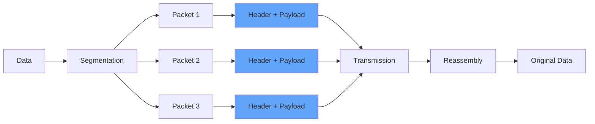
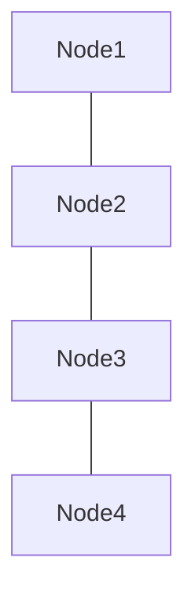
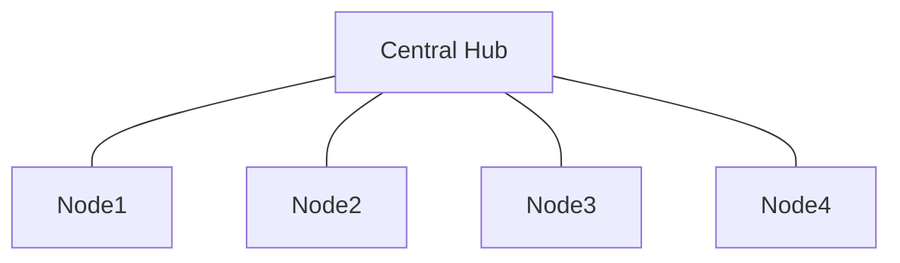
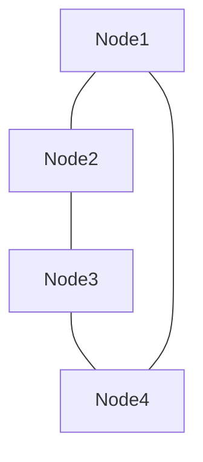
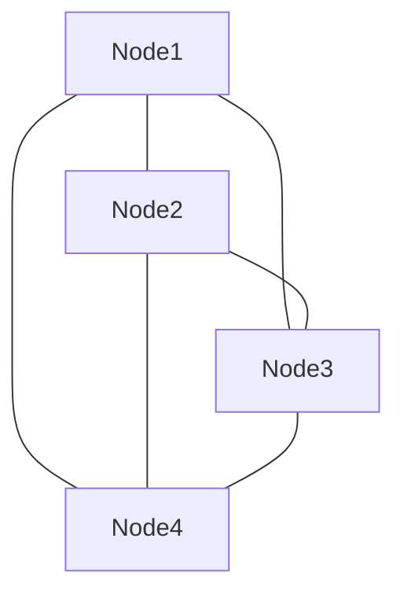
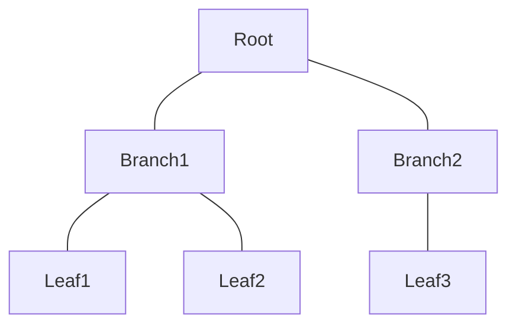
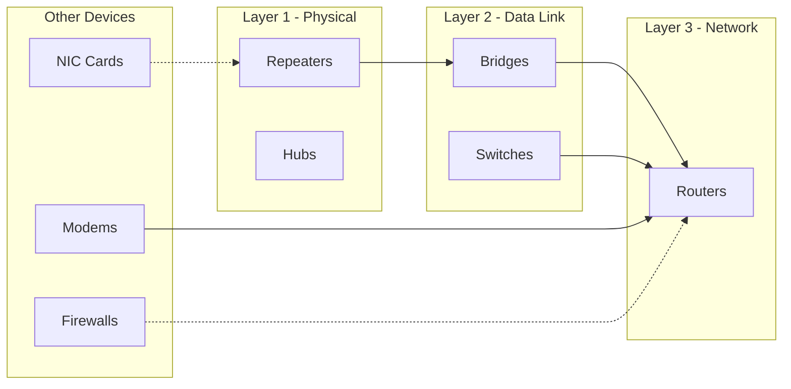
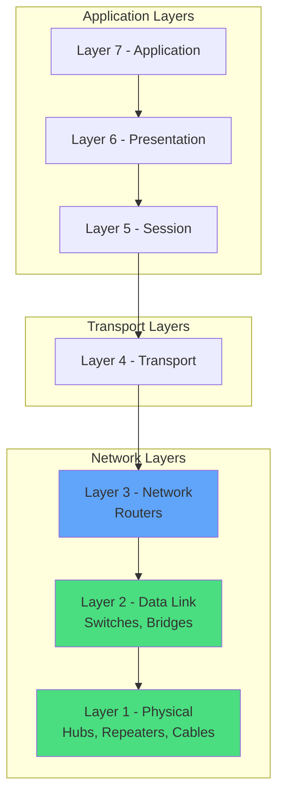

## What is a Computer Network?

A **computer network** (or data network) is a telecommunications network that allows computers to exchange data. In computer networks, networked computing devices pass data to each other along different data connections using encoding and decoding standards.

<Callout kind="info" collapsed="false">
  **Network Nodes** are devices that originate, route, and terminate data. They include hosts (PCs, phones, servers) and networking hardware (routers, switches).
</Callout>

### Network Applications

<Columns cols="2">
  <Card title="Web Access" href="#" icon="globe" horizontal="false">
    Access to World Wide Web and web-based applications.
  </Card>

  <Card title="Resource Sharing" href="#" icon="share-2" horizontal="false">
    Shared use of servers, printers, storage, and applications.
  </Card>

  <Card title="Communication" href="#" icon="message-square" horizontal="false">
    Email, instant messaging, video calls, and conferencing.
  </Card>

  <Card title="Distributed Computing" href="#" icon="cpu" horizontal="false">
    Computing resources across network to accomplish tasks.
  </Card>
</Columns>

## Network Packets

A **network packet** is a formatted unit of data carried by a packet-switched network. When data is formatted into packets, the bandwidth can be better shared among users compared to circuit-switched networks.

<ParamField path="header" param-type="bytes" required="true" deprecated="false">
  Contains control information: source/destination addresses, error detection codes, sequencing information.
</ParamField>

<ParamField path="payload" param-type="bytes" required="true" deprecated="false">
  The actual user data being transmitted between network nodes.
</ParamField>

<ParamField path="trailer" param-type="bytes" required="false" deprecated="false">
  Optional footer containing error-checking data (CRC, checksum).
</ParamField>

## Network Topology

**Network topology** is the arrangement of elements (links, nodes, etc.) of a computer network. It can be depicted physically or logically:

- **Physical Topology** - Placement of components, device locations, cable installation
- **Logical Topology** - How data flows within the network, regardless of physical design

### Common Network Topologies

<Tabs>
  <Tab title="Bus" icon="minus">
    All nodes connected to a common backbone cable. Used in early Ethernet (10BASE5, 10BASE2). Simple but single point of failure.

    Here are each of the topologies split into standalone Mermaid diagrams (one per graph):

  </Tab>

  <Tab title="Star" icon="star">
    All nodes connected to a central hub/switch. Common in Wireless LANs and modern Ethernet. Easy to manage, hub is single point of failure.

  </Tab>

  <Tab title="Ring" icon="circle">
    Each node connected to left and right neighbors. Used in FDDI. Data travels in one direction.

  </Tab>

  <Tab title="Mesh" icon="grid">
    Nodes connected to multiple neighbors. Provides redundancy and fault tolerance. Expensive due to many connections.

  </Tab>

  <Tab title="Tree" icon="git-branch">
    Hierarchical arrangement of nodes. Scalable and easy to expand. Root node failure affects entire network.

  </Tab>
</Tabs>

## Network Nodes and Devices

A **node** is a connection point, redistribution point, or communication endpoint in a network. Physical network nodes are active electronic devices capable of sending, receiving, or forwarding information.

### Network Device Types

<ParamField path="network-interface" param-type="hardware" required="true" deprecated="false">
  Network Interface Controller (NIC) provides physical connection to network. Has unique MAC address (6 octets) for Ethernet networks.
</ParamField>

<ParamField path="repeater" param-type="hardware" required="false" deprecated="false">
  Receives, cleans, and regenerates signals to extend network distance. Works at Physical Layer (Layer 1).
</ParamField>

<ParamField path="hub" param-type="hardware" required="false" deprecated="false">
  Multi-port repeater. Broadcasts incoming data to all ports. Mostly obsolete, replaced by switches.
</ParamField>

<ParamField path="bridge" param-type="hardware" required="false" deprecated="false">
  Connects and filters traffic between network segments at Data Link Layer (Layer 2). Types: Local, Remote, Wireless.
</ParamField>

<ParamField path="switch" param-type="hardware" required="true" deprecated="false">
  Forwards and filters Layer 2 datagrams based on MAC addresses. Learns MAC-to-port mappings. More efficient than hubs.
</ParamField>

<ParamField path="router" param-type="hardware" required="true" deprecated="false">
  Forwards packets between networks using Layer 3 (IP) addresses. Uses routing tables for path determination.
</ParamField>

<ParamField path="modem" param-type="hardware" required="false" deprecated="false">
  Modulates/demodulates signals for transmission over analog media (telephone lines). DSL technology example.
</ParamField>

<ParamField path="firewall" param-type="security" required="true" deprecated="false">
  Controls network security and access rules. Rejects unauthorized access while allowing recognized sources.
</ParamField>

## OSI Model and Device Layers

<Callout kind="tip" collapsed="false">
  Understanding which layer each device operates at helps in troubleshooting network issues and designing efficient network architectures.
</Callout>
