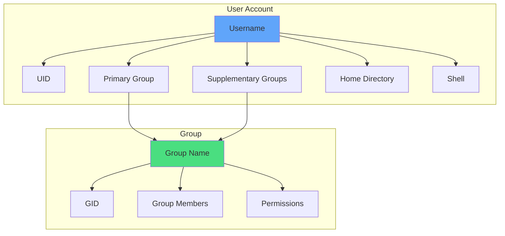
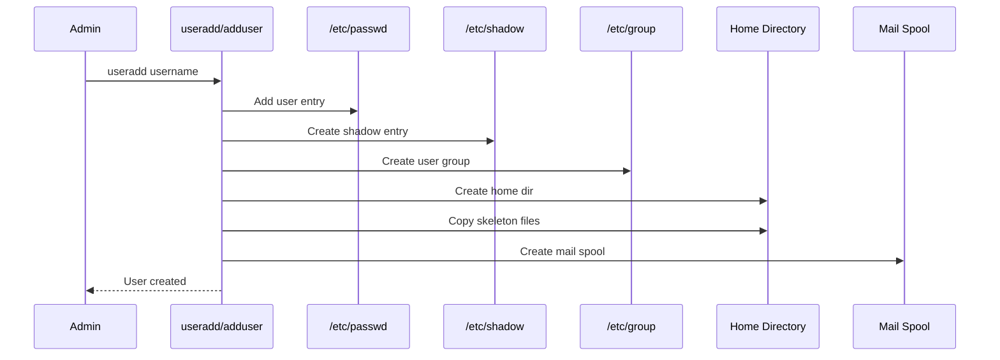

## Users and Groups

Linux/Unix operating systems have the ability to multitask in a manner similar to other operating systems. However, Linux’s major difference from other operating systems is its ability to have multiple users. Linux was designed to allow more than one user to have access to the system at the same time.

<Callout kind="info" collapsed="false">
  A **user** can be either a human being or an application account, identified by a unique numerical User ID (UID).
</Callout>

A **group** is an organizational unit tying users together for a common purpose, such as shared file permissions. Each group is associated with a Group ID (GID).



### Permission Model

<Columns cols="3">
  <Card title="Read (r)" href="#" icon="eye" horizontal="false">
    View file contents or list directory contents.
  </Card>

  <Card title="Write (w)" href="#" icon="edit" horizontal="false">
    Modify file contents or create/delete files in directory.
  </Card>

  <Card title="Execute (x)" href="#" icon="play" horizontal="false">
    Execute file as program or access/traverse directory.
  </Card>
</Columns>


## System Configuration Files

Linux stores user and group information in several key configuration files:

```mermaid
graph LR
    A[/etc/passwd] --> B[User Account Info]
    C[/etc/shadow] --> D[Encrypted Passwords]
    E[/etc/group] --> F[Group Definitions]
    G[/etc/gshadow] --> H[Group Passwords]
    I[/etc/login.defs] --> J[Login Policies]
    
    style A fill:#60a5fa
    style C fill:#f87171
    style E fill:#4ade80
    style G fill:#fbbf24
    style I fill:#a78bfa
```

### /etc/passwd - User Account Information

Stores user account information required during login. Readable by all utilities but writable only by root.

**Format:** `username:password:UID:GID:GECOS:home_directory:shell`

<Callout kind="info" collapsed="false">
  Example: `ganapathi:x:501:501:Ganapathi Chidambaram:/home/ganapathi:/bin/bash`
</Callout>

<ParamField path="username" param-type="string" required="true" deprecated="false">
  Login username (1-32 characters). Used for authentication and identification.
</ParamField>

<ParamField path="password" param-type="string" required="true" deprecated="false">
  `x` indicates encrypted password stored in /etc/shadow. `*` means locked account, `!!` means no password set.
</ParamField>

<ParamField path="uid" param-type="integer" required="true" deprecated="false">
  User ID number. UID 0 = root, 1-99 = system accounts, 100-999 = admin accounts, 1000+ = regular users.
</ParamField>

<ParamField path="gid" param-type="integer" required="true" deprecated="false">
  Primary Group ID number for the user.
</ParamField>

<ParamField path="gecos" param-type="string" required="false" deprecated="false">
  Comment field for user info (full name, phone, etc.). Used by finger command.
</ParamField>

<ParamField path="home_directory" param-type="path" required="true" deprecated="false">
  Absolute path to user's home directory. Defaults to `/` if non-existent.
</ParamField>

<ParamField path="shell" param-type="path" required="true" deprecated="false">
  Login shell executed on user login. Default: `/bin/bash`. Empty = `/bin/sh`. Non-existent = login disabled.
</ParamField>

### /etc/shadow - Encrypted Passwords

Stores encrypted password hashes and password aging information. Readable only by root.

**Format:** `username:password:last_changed:min:max:warn:inactive:expire`

<Callout kind="alert" collapsed="false">
  This file contains sensitive password data. Protect it carefully and never share its contents.
</Callout>

<ParamField path="username" param-type="string" required="true" deprecated="false">
  Login username matching /etc/passwd entry.
</ParamField>

<ParamField path="password" param-type="string" required="true" deprecated="false">
  13-24 character encrypted password hash. `!` = locked, `*` = disabled, `!!` = never set.
</ParamField>

<ParamField path="last_changed" param-type="integer" required="true" deprecated="false">
  Days since epoch (Jan 1, 1970) when password was last changed.
</ParamField>

<ParamField path="min" param-type="integer" required="false" deprecated="false">
  Minimum days before password can be changed. 0 = anytime.
</ParamField>

<ParamField path="max" param-type="integer" required="false" deprecated="false">
  Maximum days password is valid. -1 = no expiration.
</ParamField>

<ParamField path="warn" param-type="integer" required="false" deprecated="false">
  Days before expiration to warn user.
</ParamField>

<ParamField path="inactive" param-type="integer" required="false" deprecated="false">
  Days after expiration before account is disabled.
</ParamField>

<ParamField path="expire" param-type="integer" required="false" deprecated="false">
  Absolute expiration date (days since epoch). Account disabled after this date.
</ParamField>


### /etc/group - Group Definitions

Defines groups to which users belong. Groups allow delegated access to resources like disks, printers, and peripherals.

**Format:** `group_name:password:GID:member_list`

<Callout kind="info" collapsed="false">
  Example: `ganapathi:x:24:ganapathi,raja`
</Callout>

<ParamField path="group_name" param-type="string" required="true" deprecated="false">
  Group name displayed by commands like `ls -l`.
</ParamField>

<ParamField path="password" param-type="string" required="false" deprecated="false">
  Usually empty (`x`). Encrypted group password for privileged groups.
</ParamField>

<ParamField path="gid" param-type="integer" required="true" deprecated="false">
  Group ID number used by OS for access control.
</ParamField>

<ParamField path="members" param-type="list" required="false" deprecated="false">
  Comma-separated list of group member usernames.
</ParamField>

### /etc/gshadow - Group Shadow Passwords

Stores encrypted group passwords and group administrator information. Readable only by root.

**Format:** `group_name:password:admins:members`

<ParamField path="group_name" param-type="string" required="true" deprecated="false">
  Group name identifier.
</ParamField>

<ParamField path="password" param-type="string" required="false" deprecated="false">
  Encrypted group password. `!` = no access via newgrp, `!!` = never set, null = members only.
</ParamField>

<ParamField path="admins" param-type="list" required="false" deprecated="false">
  Comma-separated list of group administrators who can add/remove members via gpasswd.
</ParamField>

<ParamField path="members" param-type="list" required="false" deprecated="false">
  Comma-separated list of regular group members.
</ParamField>

## /etc/login.defs


Under Linux password related utilities and config file(s) comes from shadow password suite.It defines the site-specific configuration for this suite.The lines consist of a configuration name and value, separated by whitespace.Absence of this file will not prevent system operation, but will probably result in undesirable operation.

Blank lines and comment lines are ignored. Comments are introduced with a “#” pound sign and the pound sign must be the first non-white character of the line.

Parameter values may be of four types: strings, booleans, numbers, and long numbers. A string is comprised of any printable characters. A boolean should be either the value “yes” or “no”. An undefined boolean parameter or one with a value other than these will be given a “no” value. Numbers (both regular and long) may be either decimal values, octal values (precede the value with “0”) or hexadecimal values (precede the value with “0x”). The maximum value of the regular and long numeric parameters is machine-dependent.

The following configuration items are provided:

- **CHFN_AUTH (boolean)** :    If yes, the chfn and chsh programs will require authentication before making any changes, unless run by the superuser.

- **CHFN_RESTRICT (string)** :   This parameter specifies which values in the gecos field of the /etc/passwd file may be changed by regular users using the chfn program. It can be any combination of letters f ,r, w, h, for Full name, Room number, Work phone, and Home phone, respectively. For backward compatibility, “yes” is equivalent to “rwh” and “no” is equivalent to “frwh”. If not specified, only the superuser can make any changes. The most restrictive setting is better achieved by not installing chfn SUID.

- **DEFAULT_HOME** : Should login be allowed if we can't cd to the home directory?. Default in no.So change it as Yes for cd to the home directory.

- **ENCRYPT_METHOD** : Encryption method for the password entered by the user.More complicated algorithm is used to difficult to brute forcing the password.

- **ENV_PATH** & **ENV_SUPATH** - Default Environment path for normal user and super user login.This is must be defined to successful login of user into the system.

- **FAILLOG_ENABLE** : Enable logging and display of /var/log/faillog login failure info.

- **LOGIN_RETRIES** : Max number of login retries if password is bad. This will most likely be overriden by PAM, since
  the default pam_unix module has it's own built in of 3 retries. However, this is a safe fallback in case you are
  using an authentication module that does not enforce PAM_MAXTRIES.

- **LOGIN_TIMEOUT** : Max time in seconds for login.

- **GID_MAX (number), GID_MIN (number)** : Range of group IDs to choose from for the useradd and groupadd programs.

- **MAIL_DIR (string)** : The mail spool directory. This is needed to manipulate the mailbox when its corresponding user account is modified or deleted. If not specified, a compile-time default is used.

- **PASS_MAX_DAYS (number)** : The maximum number of days a password may be used. If the password is older than this, a password change will be forced. If not specified, -1 will be assumed (which disables the restriction).

- **PASS_MIN_DAYS (number)** :  The minimum number of days allowed between password changes. Any password changes attempted sooner than this will be rejected. If not specified, -1 will be assumed (which disables the restriction).

- **PASS_WARN_AGE (number)** :  The number of days warning given before a password expires. A zero means warning is given only upon the day of expiration, a negative value means no warning is given. If not specified, no warning will be provided.

- **UID_MAX (number), UID_MIN (number)** : Range of user IDs to choose from for the useradd program.

- **UMASK (number)** : The permission mask is initialized to this value. If not specified, the permission mask will be initialized to 022.

- **USERDEL_CMD (string)** :    If defined, this command is run when removing a user. It should remove any at/cron/print jobs etc. owned by the user to be removed (passed as the first argument).


The following cross reference shows which programs in the shadow password suite use which parameters.

- chfn  CHFN_AUTH CHFN_RESTRICT
- chsh   CHFN_AUTH
- groupadd   GID_MAX GID_MIN
- newusers  PASS_MAX_DAYS PASS_MIN_DAYS PASS_WARN_AGE UMASK
- pwconv  PASS_MAX_DAYS PASS_MIN_DAYS PASS_WARN_AGE
- useradd   GID_MAX GID_MIN PASS_MAX_DAYS PASS_MIN_DAYS PASS_WARN_AGE UID_MAX UID_MIN UMASK
- userdel  MAIL_DIR USERDEL_CMD
- usermod MAIL_DIR


## Adding a New User

### User Creation Flow



<Steps>
  <Step title="Create user with useradd" icon="user-plus" titleType="h3">
    Basic user creation with default settings.

    ```bash
    useradd username
    ```

    <Callout kind="info" collapsed="false">
      Creates user with default home directory, shell, and a group with the same name.
    </Callout>
  </Step>

  <Step title="Create user with adduser (interactive)" icon="message-circle" titleType="h3">
    Interactive user creation with prompts for additional information.

    ```bash
    adduser username
    ```

    This will prompt for:
    - Password
    - Full name
    - Room number
    - Work phone
    - Home phone
  </Step>

  <Step title="Verify user creation" icon="check" titleType="h3">
    Confirm the user was created successfully.

    ```bash
    id username
    grep username /etc/passwd
    ls -ld /home/username
    ```
  </Step>
</Steps>

### What Happens During User Creation

<Columns cols="2">
  <Card title="Home Directory" href="#" icon="folder" horizontal="false">
    Creates `/home/username` with skeleton files: `.bashrc`, `.bash_profile`, `.bash_logout`
  </Card>

  <Card title="Mail Spool" href="#" icon="mail" horizontal="false">
    Creates `/var/spool/mail/username` for user's system mail.
  </Card>

  <Card title="User Group" href="#" icon="users" horizontal="false">
    Creates a group with the same name as the user (User Group Scheme).
  </Card>

  <Card title="Configuration Files" href="#" icon="file-text" horizontal="false">
    Updates /etc/passwd, /etc/shadow, /etc/group, /etc/gshadow.
  </Card>
</Columns>


### Common useradd Options

<ExpandableGroup>
  <Expandable title="Home Directory Options" default-open="false">
    <ParamField path="-d, --home" param-type="path" required="false" deprecated="false">
      Specify custom home directory path. Example: `useradd -d /custom/home username`
    </ParamField>

    <ParamField path="-m, --create-home" param-type="flag" required="false" deprecated="false">
      Create home directory if it doesn’t exist. Copies skeleton files.
    </ParamField>

    <ParamField path="-M" param-type="flag" required="false" deprecated="false">
      Do NOT create home directory (overrides CREATE_HOME in /etc/login.defs).
    </ParamField>

    <ParamField path="-k, --skel" param-type="path" required="false" deprecated="false">
      Specify skeleton directory for template files. Default: `/etc/skel`
    </ParamField>
  </Expandable>

  <Expandable title="Account Expiration" default-open="false">
    <ParamField path="-e, --expiredate" param-type="date" required="false" deprecated="false">
      Set account expiration date (YYYY-MM-DD). Example: `useradd -e 2025-12-31 username`
    </ParamField>

    <ParamField path="-f, --inactive" param-type="integer" required="false" deprecated="false">
      Days of inactivity before account expires. 0 = immediate, -1 = disable feature.
    </ParamField>
  </Expandable>

  <Expandable title="UID and Group Options" default-open="false">
    <ParamField path="-u, --uid" param-type="integer" required="false" deprecated="false">
      Specify specific UID. Must be unique unless combined with `-o`.
    </ParamField>

    <ParamField path="-g, --gid" param-type="integer" required="false" deprecated="false">
      Specify primary group (name or GID). Group must exist.
    </ParamField>

    <ParamField path="-G, --groups" param-type="list" required="false" deprecated="false">
      Supplementary groups (comma-separated). Example: `-G wheel,docker,adm`
    </ParamField>

    <ParamField path="-U, --user-group" param-type="flag" required="false" deprecated="false">
      Create group with same name as user (default behavior).
    </ParamField>

    <ParamField path="-N, --no-user-group" param-type="flag" required="false" deprecated="false">
      Do NOT create user group. Use GROUP variable default.
    </ParamField>

    <ParamField path="-o, --non-unique" param-type="flag" required="false" deprecated="false">
      Allow duplicate UID. Only valid with `-u`.
    </ParamField>
  </Expandable>

  <Expandable title="Shell and Password" default-open="false">
    <ParamField path="-s, --shell" param-type="path" required="false" deprecated="false">
      Specify login shell. Example: `useradd -s /bin/zsh username`
    </ParamField>

    <ParamField path="-p, --password" param-type="string" required="false" deprecated="false">
      Encrypted password (from crypt(3)). <Callout kind="alert" inline="true">Not recommended - visible in process list.</Callout>
    </ParamField>

    <ParamField path="-L, --lock" param-type="flag" required="false" deprecated="false">
      Lock account by prepending `!` to password.
    </ParamField>
  </Expandable>

  <Expandable title="System Accounts" default-open="false">
    <ParamField path="-r, --system" param-type="flag" required="false" deprecated="false">
      Create system account. Uses SYS_UID_MIN-SYS_UID_MAX range. No aging info, no home dir by default.
    </ParamField>

    <ParamField path="--root CHROOT_DIR" param-type="path" required="false" deprecated="false">
      Apply changes in chroot directory. Use configuration from CHROOT_DIR.
    </ParamField>
  </Expandable>
</ExpandableGroup>


### adduser Options

- **--conf FILE**

    Use FILE instead of /etc/adduser.conf.

- **--disabled-login**

    Do not run passwd to set the password.  The user won't be able to use her account until the password is set.

- **--disabled-password**

    Like --disabled-login, but logins are still possible (for example using SSH RSA keys) but not using password authentication.

- **--force-badname**

    By  default,  user  and  group names are checked against the configurable regular expression NAME_REGEX (or NAME_REGEX_SYSTEM if
    --system is specified) specified in the configuration file. This option forces adduser and addgroup to apply only a  weak  check
    for validity of the name.

- **--gecos GECOS**

    Set the gecos field for the new entry generated.  adduser will not ask for finger information if this option is given.

- **--gid ID**

    When  creating  a  group, this option forces the new groupid to be the given number.  When creating a user, this option will put
      the user in that group.

- **--group**

    When combined with --system, a group with the same name and ID as the system user is created.  If not combined with --system,  a
    group with the given name is created.  This is the default action if the program is invoked as addgroup.

- **--home DIR**

    Use  DIR  as  the user's home directory, rather than the default specified by the configuration file.  If the directory does not
    exist, it is created and skeleton files are copied.


## Adding a Group

To add a group to the system, use the command groupadd/addgroup and syntax as follows :

```bash
    groupadd <group-name>
    addgroup <group-name>
```

### groupadd Options

- **-g `<gid>`**

    Group ID for the group, which must be unique and greater than 499

- **-r**

    Create a system group with a GID less than 500

- **-f**

    When used with -g `<gid>` and `<gid>` already exists, groupadd will choose another unique `<gid>` for the group.

### addgroup Options


- **-g `<gid>`**

    Group ID for the group, which must be unique and greater than 499


## User Modification

By usermod command we can modify the existing available users on the system with help of below configuration.

- **-a, --append**

    Add the user to the supplementary group(s). Use only with the -G option.

- **-c, --comment COMMENT**

    The new value of the user's password file comment field. It is normally modified using the chfn(1) utility.

- **-d, --home HOME_DIR**

    The user's new login directory.

    If the -m option is given, the contents of the current home directory will be moved to the new home directory, which is
    created if it does not already exist.

- **-e, --expiredate EXPIRE_DATE**

    The date on which the user account will be disabled. The date is specified in the format YYYY-MM-DD.

    An empty EXPIRE_DATE argument will disable the expiration of the account.

    This option requires a /etc/shadow file. A /etc/shadow entry will be created if there were none.

- **-f, --inactive INACTIVE**

    The number of days after a password expires until the account is permanently disabled.

    A value of 0 disables the account as soon as the password has expired, and a value of -1 disables the feature.

    This option requires a /etc/shadow file. A /etc/shadow entry will be created if there were none.

- **-g, --gid GROUP**

    The group name or number of the user's new initial login group. The group must exist.

    Any file from the user's home directory owned by the previous primary group of the user will be owned by this new group.

    The group ownership of files outside of the user's home directory must be fixed manually.

- **-G, --groups GROUP1[,GROUP2,...[,GROUPN]]]**

    A list of supplementary groups which the user is also a member of. Each group is separated from the next by a comma, with no
    intervening whitespace. The groups are subject to the same restrictions as the group given with the -g option.

    If the user is currently a member of a group which is not listed, the user will be removed from the group. This behaviour
    can be changed via the -a option, which appends the user to the current supplementary group list.

- **-l, --login NEW_LOGIN**

    The name of the user will be changed from LOGIN to NEW_LOGIN. Nothing else is changed. In particular, the user's home
    directory or mail spool should probably be renamed manually to reflect the new login name.

- **-L, --lock**

    Lock a user's password. This puts a '!' in front of the encrypted password, effectively disabling the password. You can't
    use this option with -p or -U.

    !!! note
         if you wish to lock the account (not only access with a password), you should also set the EXPIRE_DATE to 1.

- **-m, --move-home**

    Move the content of the user's home directory to the new location.

    This option is only valid in combination with the -d (or --home) option.

    usermod will try to adapt the ownership of the files and to copy the modes, ACL and extended attributes, but manual changes
    might be needed afterwards.

- **-o, --non-unique**

    When used with the -u option, this option allows to change the user ID to a non-unique value.

- **-p, --password PASSWORD**

    The encrypted password, as returned by crypt(3).

    !!! note
        This option is not recommended because the password (or encrypted password) will be visible by users listing the
        processes.

    The password will be written in the local /etc/passwd or /etc/shadow file. This might differ from the password database
    configured in your PAM configuration.


## Password Aging

For security reasons, it is advisable to require users to change their passwords periodically.To configure password expiration
for a user from a shell prompt, use the chage command, followed by an option which is mentioned below ,followed by the
username of the user.

- **-m`<days>`**

    Specifies the minimum number of days between which the user must change passwords. If the value is 0, the password does not expire.

- **-M`<days>`**

    Specifies the maximum number of days for which the password is valid. When the number of days specified by this option plus the number of days specified with the -d option is less than the current day, the user must change passwords before using the account.

- **-d`<days>`**

    Specifies the number of days since January 1, 1970 the password was changed

- **-I`<days>`**

    Specifies the number of inactive days after the password expiration before locking the account. If the value is 0, the account is not locked after the password expires.

- **-E`<date>`**

    Specifies the date on which the account is locked, in the format YYYY-MM-DD. Instead of the date, the number of days since January 1, 1970 can also be used.

- **-W`<days>`**

    Specifies the number of days before the password expiration date to warn the user.