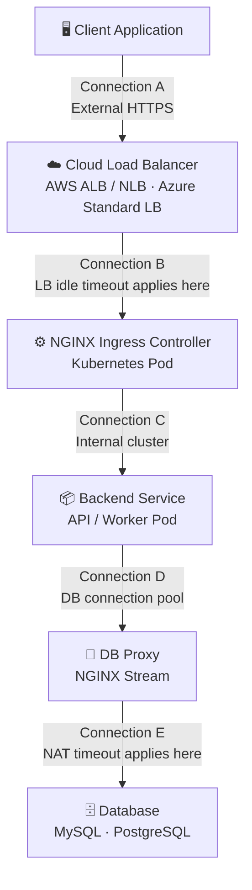
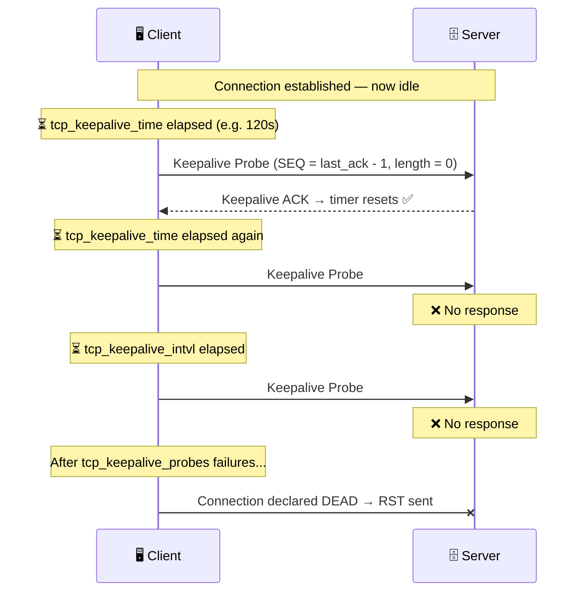
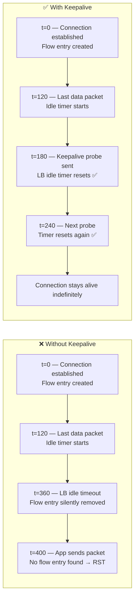
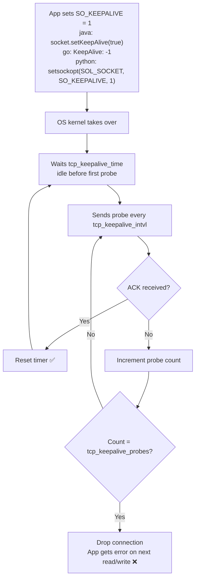

## Overview

TCP keepalive is an OS-level mechanism that sends zero-byte probe packets on idle TCP connections to verify the remote peer is still reachable. Without it, firewalls, NAT gateways, and cloud load balancers silently drop idle connections — causing `connection reset by peer` errors that are difficult to trace.

This document covers the full stack: OS configuration, packet capture and analysis, Go client implementation, cloud load balancer alignment, NGINX Ingress, and database proxy patterns.

---

## 1. Architecture

### Multi-Layer Connection Stack



> **Key insight:** TCP keepalive only affects the connection **where it is configured**. NGINX terminates and re-creates connections — Connection B and Connection C are independent TCP sessions.

---

## 2. Core Concepts

### How TCP Keepalive Works



### What Makes a Keepalive Packet

| Property | Value | Reason |
|---|---|---|
| Payload length | **0 bytes** | Pure probe — no application data |
| TCP Flags | **ACK only** `[.]` | Not SYN, FIN, RST, or PSH |
| SEQ number | **last_ack − 1** | One below expected — deliberate probe signature |
| Direction | Client → Server, then Server → Client | Probe + ACK pair |

### With vs Without Keepalive at Load Balancer



---

## 3. OS Sysctl Parameters

### Read Current Values

```bash
sysctl net.ipv4.tcp_keepalive_time \
       net.ipv4.tcp_keepalive_intvl \
       net.ipv4.tcp_keepalive_probes
```

### Parameter Reference

| Parameter | Default | Description |
|---|---|---|
| `tcp_keepalive_time` | 7200s (2h) | Seconds of idle before the **first** probe is sent |
| `tcp_keepalive_intvl` | 75s | Seconds between **subsequent** probes |
| `tcp_keepalive_probes` | 9 | Max unacknowledged probes before connection is dropped |

> **Total dead-connection detection time** = `tcp_keepalive_time + (tcp_keepalive_intvl × tcp_keepalive_probes)`
> Example: `120 + (10 × 9) = 210s`

### Lower for Testing

```bash
sudo sysctl -w net.ipv4.tcp_keepalive_time=10
sudo sysctl -w net.ipv4.tcp_keepalive_intvl=5
sudo sysctl -w net.ipv4.tcp_keepalive_probes=3
```

To persist across reboots, add to `/etc/sysctl.conf`:

```ini
net.ipv4.tcp_keepalive_time = 120
net.ipv4.tcp_keepalive_intvl = 15
net.ipv4.tcp_keepalive_probes = 9
```

---

## 4. Packet Capture — tcpdump

### Capture Full Stream to pcap (Recommended)

Always capture the **full TCP stream** including the handshake. Without stream context, tshark cannot label keepalive probes correctly.

```bash
sudo tcpdump -i eth0 -w keepalive_3306.pcap 'tcp port 3306'
```

### Live Capture — Keepalives Only

Uses a BPF expression to compute TCP payload length inline and match zero-byte ACKs:

```bash
sudo tcpdump -i eth0 -nn \
  'tcp port 3306 and (tcp[tcpflags] & tcp-ack != 0) and \
  (ip[2:2] - ((ip[0] & 0xf)<<2) - ((tcp[12] & 0xf0)>>2)) == 0'
```

### Read a Saved pcap

```bash
tcpdump -nn -r keepalive_3306.pcap
```

### Reading tcpdump Output

```
14:23:01.123456 IP 10.0.0.1.54321 > 10.0.0.2.3306: Flags [.], seq 999:999, ack 1000, win 512, length 0
14:23:01.124100 IP 10.0.0.2.3306 > 10.0.0.1.54321: Flags [.], seq 1000:1000, ack 1000, win 512, length 0
```

| Field | Value | Meaning |
|---|---|---|
| `Flags [.]` | `.` = ACK only | No SYN, FIN, RST — pure ACK |
| `seq 999:999` | Start = End | Zero bytes of data — probe signature |
| `length 0` | 0 | Confirms zero payload |
| Line 2 | Direction reversed | Server ACK — connection confirmed alive |

> **Note:** Replace `eth0` with your actual interface. Run `ip link` or `tcpdump -D` to list available interfaces.

---

## 5. Packet Analysis — tshark

### Read pcap — Keepalives Only

```bash
tshark -r keepalive_3306.pcap \
  -Y 'tcp.analysis.keep_alive or tcp.analysis.keep_alive_ack' \
  -T fields \
  -e frame.time \
  -e ip.src \
  -e ip.dst \
  -e tcp.srcport \
  -e tcp.dstport \
  -e tcp.seq \
  -e tcp.ack \
  -E header=y \
  -E separator=$'\t'
```

### Live Capture with tshark

```bash
tshark -i eth0 \
  -Y 'tcp.analysis.keep_alive or tcp.analysis.keep_alive_ack' \
  -T fields \
  -e frame.time -e ip.src -e ip.dst \
  -e tcp.srcport -e tcp.dstport -e tcp.seq -e tcp.ack \
  -E header=y -E separator=$'\t'
```

### Sample Output

```
frame.time              ip.src      ip.dst      srcport  dstport  seq   ack
Apr 29, 2026 14:23:01   10.0.0.1    10.0.0.2    54321    3306     999   1000
Apr 29, 2026 14:23:01   10.0.0.2    10.0.0.1    3306     54321    1000  1000
Apr 29, 2026 14:23:11   10.0.0.1    10.0.0.2    54321    3306     999   1000
```

| Field | Meaning |
|---|---|
| `tcp.seq = 999` | SEQ is one below the expected byte — probe signature |
| Row 1 → Row 2 | Probe then ACK — peer alive |
| Time delta between row 1 and row 3 | Should match `tcp_keepalive_intvl` |

> **Why the pcap must include the handshake:** `tcp.analysis.keep_alive` requires tshark to track the stream from the SYN. Pre-filtering with tcpdump BPF before saving strips the handshake — tshark returns no rows even though the packets are correct.

---

## 6. Connection Monitoring — ss

### Check Keepalive Timer

```bash
ss -tnop | grep 3306 | grep timer
```

### Watch Live

```bash
watch -n 1 'ss -tnop | grep 3306 | grep timer'
```

### Sample Output

```
ESTAB 0 0 10.0.0.1:54321 10.0.0.2:3306 users:(("app",pid=1234,fd=7)) timer:(keepalive,58s,0)
```

### Timer Field Reference

```
timer:(  keepalive,   58s,   0  )
         ^            ^      ^
         type         |      unacknowledged probe count
                      countdown to next probe
```

| Timer Value | Connection State |
|---|---|
| `timer:(keepalive,Xs,0)` | **Idle** — timer counting down to next probe |
| `timer:(on,Xms,0)` | **Active** — retransmit timer, data in flight |
| `timer:(keepalive,0s,0)` | Probe being sent right now |
| No `timer:` field | Established, no pending timer |

When the unacknowledged probe count reaches `tcp_keepalive_probes`, the OS drops the connection and the application receives an error on the next read or write.

---

## 7. Go Client Implementation

Production-ready client supporting both JDBC URL format and direct DSN format to test keep alive probe packet flow with its kernel settings.

```go
package main

import (
	"context"
	"database/sql"
	"fmt"
	"log"
	"net"
	"net/url"
	"os"
	"strconv"
	"strings"
	"time"

	"github.com/go-sql-driver/mysql"
)

func main() {
	jdbcURL := os.Getenv("DB_URL")
	directDSN := os.Getenv("DB_DSN")

	var dsn string
	var err error

	switch {
	case jdbcURL != "":
		fmt.Println("[CLIENT] Input format: JDBC URL")
		dsn, err = jdbcToMySQLDSN(jdbcURL)
		if err != nil {
			log.Fatalf("Failed to parse JDBC URL: %v", err)
		}

	case directDSN != "":
		fmt.Println("[CLIENT] Input format: Direct DSN")
		dsn = directDSN

	default:
		log.Fatal("Set either DB_URL (JDBC) or DB_DSN (direct) environment variable")
	}

	registerKeepaliveDialer()
	dsn = strings.Replace(dsn, "@tcp(", "@tcp-keepalive(", 1)

	fmt.Printf("[CLIENT] DSN: %s\n", maskPassword(dsn))

	db, err := sql.Open("mysql", dsn)
	if err != nil {
		log.Fatalf("Failed to open database: %v", err)
	}
	defer db.Close()

	db.SetMaxOpenConns(1)
	db.SetMaxIdleConns(1)
	db.SetConnMaxLifetime(0)

	if err := db.Ping(); err != nil {
		log.Fatalf("Failed to connect: %v", err)
	}

	fmt.Println("[CLIENT] Connected. Connection is now IDLE.")
	fmt.Println("[CLIENT] OS will send keepalive probes using sysctl values.")
	fmt.Println(strings.Repeat("=", 60))

	startTime := time.Now()
	ticker := time.NewTicker(30 * time.Second)
	defer ticker.Stop()

	for range ticker.C {
		fmt.Printf("[CLIENT] Idle for %ds — run: ss -tnop | grep 3306 | grep timer\n",
			int(time.Since(startTime).Seconds()))
	}
}

// registerKeepaliveDialer enables SO_KEEPALIVE on every new MySQL connection.
//
// KeepAlive: -1 enables the socket option without overriding OS sysctl values.
// The kernel applies tcp_keepalive_time, tcp_keepalive_intvl, and tcp_keepalive_probes
// automatically — the application does not need to read or pass those values.
func registerKeepaliveDialer() {
	mysql.RegisterDialContext("tcp-keepalive", func(ctx context.Context, addr string) (net.Conn, error) {
		dialer := &net.Dialer{
			Timeout: 10 * time.Second,
			// -1 enables SO_KEEPALIVE and delegates all timing to OS sysctl.
			// Do not set a positive duration here — that overrides sysctl values
			// and prevents operators from tuning keepalive without a code change.
			KeepAlive: -1,
		}

		conn, err := dialer.DialContext(ctx, "tcp", addr)
		if err != nil {
			return nil, err
		}

		fmt.Println("[CLIENT] SO_KEEPALIVE enabled — OS sysctl values apply automatically")
		return conn, nil
	})
}

// jdbcToMySQLDSN converts a JDBC connection URL to a Go MySQL DSN.
//
// Input:
//
//	jdbc:mysql://host:port/database?param1=value1&param2=value2
//
// Output:
//
//	user:password@tcp(host:port)/database?param1=value1
//
// Credentials are read from DB_USER and DB_PASSWORD environment variables.
func jdbcToMySQLDSN(jdbcURL string) (string, error) {
	if !strings.HasPrefix(jdbcURL, "jdbc:mysql://") {
		return "", fmt.Errorf("invalid JDBC URL: must start with jdbc:mysql://")
	}

	raw := strings.TrimPrefix(jdbcURL, "jdbc:mysql://")
	parts := strings.SplitN(raw, "/", 2)
	if len(parts) != 2 {
		return "", fmt.Errorf("invalid JDBC URL: missing database path")
	}

	hostPort := parts[0]
	dbParts := strings.SplitN(parts[1], "?", 2)
	database := dbParts[0]

	params := url.Values{}
	params.Set("parseTime", "true")

	if len(dbParts) > 1 {
		for _, pair := range strings.Split(dbParts[1], "&") {
			kv := strings.SplitN(pair, "=", 2)
			if len(kv) != 2 {
				continue
			}
			key, value := kv[0], kv[1]

			switch key {
			case "useSSL":
				if value == "true" {
					params.Set("tls", "true")
				}
			case "requireSSL":
				if value == "true" {
					params.Set("tls", "skip-verify")
				}
			case "characterEncoding":
				params.Set("charset", value)
			case "connectTimeout":
				if ms, err := strconv.Atoi(value); err == nil {
					params.Set("timeout", fmt.Sprintf("%dms", ms))
				}
			case "socketTimeout":
				if ms, err := strconv.Atoi(value); err == nil {
					params.Set("readTimeout", fmt.Sprintf("%dms", ms))
					params.Set("writeTimeout", fmt.Sprintf("%dms", ms))
				}
			// Intentionally ignored — handled by registerKeepaliveDialer or not applicable in Go:
			// tcpKeepAlive, autoReconnect, cacheServerConfiguration, sessionVariables,
			// zeroDateTimeBehavior, scrollTolerantForwardOnly, jdbcCompliantTruncation
			}
		}
	}

	user := getEnv("DB_USER", "root")
	password := getEnv("DB_PASSWORD", "")

	return fmt.Sprintf("%s:%s@tcp(%s)/%s?%s", user, password, hostPort, database, params.Encode()), nil
}

func getEnv(key, defaultValue string) string {
	if v := os.Getenv(key); v != "" {
		return v
	}
	return defaultValue
}

func maskPassword(dsn string) string {
	at := strings.Index(dsn, "@")
	if at == -1 {
		return dsn
	}
	userPass := dsn[:at]
	colon := strings.Index(userPass, ":")
	if colon == -1 {
		return dsn
	}
	return userPass[:colon] + ":****@" + dsn[at+1:]
}
```

### Environment Variables

| Variable | Format | Example |
|---|---|---|
| `DB_URL` | JDBC URL | `jdbc:mysql://host:3306/db?useSSL=true&tcpKeepAlive=true` |
| `DB_DSN` | Go MySQL DSN | `user:pass@tcp(host:3306)/db?tls=skip-verify` |
| `DB_USER` | Plain string | `appuser` |
| `DB_PASSWORD` | Plain string | `secret` |

### DSN Format Reference

```
# Direct DSN (DB_DSN)
user:password@tcp(host:port)/database?param=value

# With TLS + charset
appuser:secret@tcp(mysql.internal:3306)/mydb?tls=skip-verify&parseTime=true&charset=utf8

# JDBC URL (DB_URL) — converted automatically by jdbcToMySQLDSN
jdbc:mysql://mysql.internal:3306/mydb?useSSL=true&requireSSL=true&characterEncoding=utf8&tcpKeepAlive=true
```

### JDBC Parameter Mapping

| JDBC Parameter | Go DSN Equivalent | Notes |
|---|---|---|
| `useSSL=true` | `tls=true` | |
| `requireSSL=true` | `tls=skip-verify` | Certificate not verified |
| `characterEncoding=utf8` | `charset=utf8` | |
| `connectTimeout=5000` | `timeout=5000ms` | Milliseconds |
| `socketTimeout=30000` | `readTimeout=30000ms` + `writeTimeout=30000ms` | |
| `tcpKeepAlive=true` | Handled by custom dialer | Not a DSN parameter |
| `autoReconnect=true` | Not mapped | Handled by connection pool |
| `sessionVariables=...` | Not mapped | JDBC-specific |

---

## 8. Cloud Load Balancer Alignment

### How Modern Apps Enable Keepalive

Applications set **only `SO_KEEPALIVE`** on the socket. The kernel applies all three sysctl values automatically — the app never reads or sets them directly.



> **Do not** set `TCP_KEEPIDLE`, `TCP_KEEPINTVL`, or `TCP_KEEPCNT` in application code unless you have a per-connection requirement that must differ from the system default. Hardcoding these prevents operators from tuning keepalive via sysctl without a code deployment.

### Timeout Formula

```
tcp_keepalive_time  =  LB_timeout × 0.5     (50% safety margin)
tcp_keepalive_intvl =  10 – 30s             (based on network latency)
tcp_keepalive_probes=  6 – 9                (balance detection speed vs tolerance)
```

### Cloud Provider Timeout Matrix

| Provider | LB Type | LB Idle Timeout | Recommended `keepalive_time` | Configurable? |
|---|---|---|---|---|
| AWS | ALB | 60s (default) | 30s | Yes — 1 to 4000s |
| AWS | NLB | 350s (**fixed**) | 180s | Yes - 60-6000 seconds |
| Azure | Standard LB | 240s (default) | 120s | Yes — 4 to 30 min |

### AWS ALB — Configure Idle Timeout

ALB idle timeout is **not configurable via Kubernetes Service annotation**. Use AWS CLI or Terraform:

```bash
ALB_ARN=$(aws elbv2 describe-load-balancers \
  --query 'LoadBalancers[?contains(LoadBalancerName, `k8s`)].LoadBalancerArn' \
  --output text)

aws elbv2 modify-load-balancer-attributes \
  --load-balancer-arn $ALB_ARN \
  --attributes Key=idle_timeout.timeout_seconds,Value=120
```

### Azure Standard LB — Configure via Annotation

```yaml
apiVersion: v1
kind: Service
metadata:
  annotations:
    service.beta.kubernetes.io/azure-load-balancer-sku: "Standard"
    service.beta.kubernetes.io/azure-load-balancer-tcp-idle-timeout: "10"  # minutes, range: 4–30
```

---

## 9. Kubernetes & NGINX Ingress

### Set Sysctl via Pod Security Context

```yaml
spec:
  securityContext:
    sysctls:
    - name: net.ipv4.tcp_keepalive_time
      value: "120"
    - name: net.ipv4.tcp_keepalive_intvl
      value: "15"
    - name: net.ipv4.tcp_keepalive_probes
      value: "9"
```

### NGINX Ingress ConfigMap — Key Settings

```yaml
apiVersion: v1
kind: ConfigMap
metadata:
  name: ingress-nginx-controller
  namespace: ingress-nginx
data:
  # Client-side: keep idle client connections open (must be < LB timeout)
  keep-alive: "120"
  keep-alive-requests: "1000"

  # Upstream: connection pool to backend pods
  upstream-keepalive-connections: "64"
  upstream-keepalive-timeout: "60"
  upstream-keepalive-requests: "1000"

  # Proxy timeouts
  proxy-connect-timeout: "10"
  proxy-read-timeout: "120"
  proxy-send-timeout: "120"
```

### Per-Route Timeout Overrides

```yaml
apiVersion: networking.k8s.io/v1
kind: Ingress
metadata:
  annotations:
    nginx.ingress.kubernetes.io/proxy-read-timeout: "120"
    nginx.ingress.kubernetes.io/proxy-send-timeout: "120"
    nginx.ingress.kubernetes.io/proxy-connect-timeout: "10"
    nginx.ingress.kubernetes.io/upstream-keepalive-timeout: "60"
```

### WebSocket / Long-Lived Connections

```yaml
metadata:
  annotations:
    nginx.ingress.kubernetes.io/proxy-read-timeout: "3600"
    nginx.ingress.kubernetes.io/proxy-send-timeout: "3600"
    nginx.ingress.kubernetes.io/websocket-services: "websocket-svc"
```

### Environment Quick-Reference

| Environment | LB Timeout | `keepalive_time` | NGINX `keep-alive` |
|---|---|---|---|
| AWS ALB default | 60s | 30s | 50s |
| AWS NLB (fixed) | 350s | 180s | 300s |
| Azure default | 240s | 120s | 120s |

---

## 10. Database Proxy Patterns

### NGINX Stream Proxy for MySQL / PostgreSQL

```nginx
stream {
    upstream mysql_backend {
        server mysql.internal:3306;
    }

    server {
        listen 3306;
        proxy_pass mysql_backend;

        # Must be shorter than: DB wait_timeout, Cloud NAT timeout, firewall timeout
        proxy_timeout 300s;
        proxy_connect_timeout 10s;

        # Enables SO_KEEPALIVE using system sysctl values
        proxy_socket_keepalive on;
    }
}
```

### Database Idle Timeout Reference

**Fix:** Ensure `proxy_timeout` is shorter than the application's connection pool idle time, and enable `proxy_socket_keepalive on`.

| Database | Default Idle Timeout | Relevant Parameters |
|---|---|---|
| MySQL | 28800s (8h) | `wait_timeout`, `interactive_timeout` |
| PostgreSQL | Infinite | `tcp_keepalives_idle`, `tcp_keepalives_interval` |
| MongoDB | Infinite | `net.maxIdleTimeMs` |
| Redis | Infinite | `timeout` |

---

## 11. Reference Tables

### Full Diagnostic Command Set

| Purpose | Command |
|---|---|
| View sysctl values | `sysctl net.ipv4.tcp_keepalive_time net.ipv4.tcp_keepalive_intvl net.ipv4.tcp_keepalive_probes` |
| Capture full stream to pcap | `sudo tcpdump -i eth0 -w keepalive_3306.pcap 'tcp port 3306'` |
| Live keepalive-only capture | `sudo tcpdump -i eth0 -nn 'tcp port 3306 and (tcp[tcpflags] & tcp-ack != 0) and (ip[2:2] - ((ip[0] & 0xf)<<2) - ((tcp[12] & 0xf0)>>2)) == 0'` |
| Read raw pcap | `tcpdump -nn -r keepalive_3306.pcap` |
| Analyse pcap with tshark | `tshark -r keepalive_3306.pcap -Y 'tcp.analysis.keep_alive or tcp.analysis.keep_alive_ack' -T fields -e frame.time -e ip.src -e ip.dst -e tcp.srcport -e tcp.dstport -e tcp.seq -e tcp.ack -E header=y -E separator='\t'` |
| Check socket keepalive timer | `ss -tnop \| grep 3306 \| grep timer` |
| Watch timer countdown live | `watch -n 1 'ss -tnop \| grep 3306 \| grep timer'` |

### Language Keepalive Equivalents

| Language / Stack | How `SO_KEEPALIVE` is enabled |
|---|---|
| Java / JDBC | `socket.setKeepAlive(true)` or `tcpKeepAlive=true` in connection URL |
| Go (`net.Dialer`) | `KeepAlive: -1` |
| Python | `socket.setsockopt(SOL_SOCKET, SO_KEEPALIVE, 1)` |
| Node.js | `socket.setKeepAlive(true)` |
| C | `setsockopt(fd, SOL_SOCKET, SO_KEEPALIVE, &val, sizeof(val))` |
| NGINX Stream | `proxy_socket_keepalive on` |

All of the above result in the same syscall: `setsockopt(fd, SOL_SOCKET, SO_KEEPALIVE, 1)`. The kernel does the rest.

---

## 12. Troubleshooting

### Common Issues

| Symptom | Cause | Fix |
|---|---|---|
| `tshark` returns no rows from pcap | pcap captured without handshake | Recapture with `'tcp port 3306'` — no BPF payload filter |
| `ss` shows no `timer:(keepalive,...)` | `SO_KEEPALIVE` not set | Set `KeepAlive: -1` in dialer or `tcpKeepAlive=true` in JDBC URL |
| Probe interval much longer than sysctl | App sends periodic queries | Remove app-level heartbeat — keepalive only fires on **idle** connections |
| 0 packets captured | Wrong network interface | Run `ip link` or `tcpdump -D` |
| `connection reset by peer` after idle | LB or NAT timeout shorter than `keepalive_time` | Lower `tcp_keepalive_time` to 50% of LB idle timeout |
| Keepalive fires but connection still drops | Firewall discarding probes | Firewall may be stripping keepalive packets — escalate to network team |

### Full Diagnostic Sequence

```bash
# 1. Check OS values
sysctl net.ipv4.tcp_keepalive_time net.ipv4.tcp_keepalive_intvl net.ipv4.tcp_keepalive_probes

# 2. Lower for testing
sudo sysctl -w net.ipv4.tcp_keepalive_time=10
sudo sysctl -w net.ipv4.tcp_keepalive_intvl=5
sudo sysctl -w net.ipv4.tcp_keepalive_probes=3

# 3. Start full stream capture
sudo tcpdump -i eth0 -w keepalive_3306.pcap 'tcp port 3306'

# 4. In another terminal — watch timer countdown
watch -n 1 'ss -tnop | grep 3306 | grep timer'

# 5. Analyse pcap with tshark
tshark -r keepalive_3306.pcap \
  -Y 'tcp.analysis.keep_alive or tcp.analysis.keep_alive_ack' \
  -T fields -e frame.time -e ip.src -e ip.dst \
  -e tcp.srcport -e tcp.dstport -e tcp.seq -e tcp.ack \
  -E header=y -E separator='\t'

# 6. Quick raw read
tcpdump -nn -r keepalive_3306.pcap
```

---

## References

| Resource | URL |
|---|---|
| AWS ALB Idle Timeout | https://docs.aws.amazon.com/elasticloadbalancing/latest/application/application-load-balancers.html |
| AWS NLB Idle Timeout | https://docs.aws.amazon.com/elasticloadbalancing/latest/network/network-load-balancers.html |
| AWS LB Controller Annotations | https://kubernetes-sigs.github.io/aws-load-balancer-controller/v2.6/guide/service/annotations/ |
| Azure LB TCP Idle Timeout | https://learn.microsoft.com/en-us/azure/load-balancer/load-balancer-tcp-idle-timeout |
| Azure Service Annotations | https://cloud-provider-azure.sigs.k8s.io/topics/loadbalancer/ |
| NGINX Ingress ConfigMap | https://kubernetes.github.io/ingress-nginx/user-guide/nginx-configuration/configmap/ |
| NGINX Ingress Annotations | https://kubernetes.github.io/ingress-nginx/user-guide/nginx-configuration/annotations/ |
| Linux TCP sysctl Reference | https://www.kernel.org/doc/Documentation/networking/ip-sysctl.txt |

