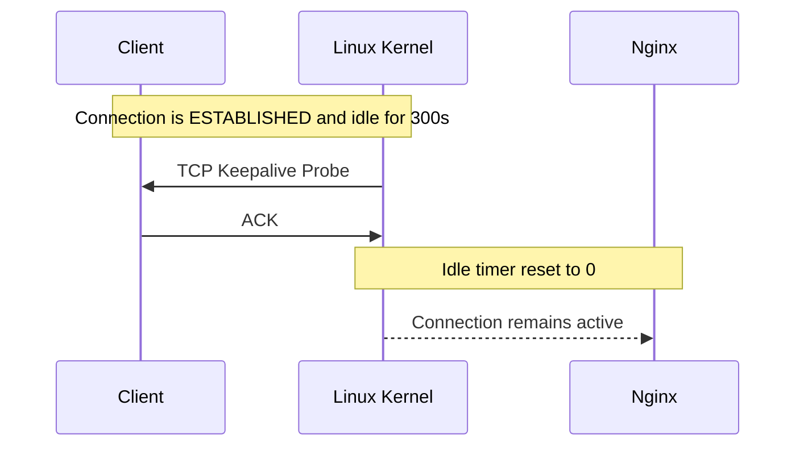
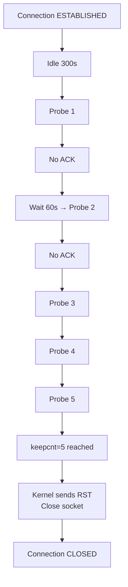
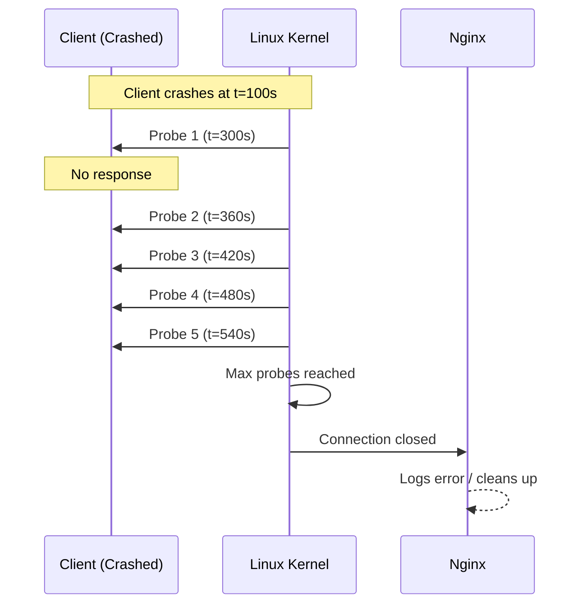
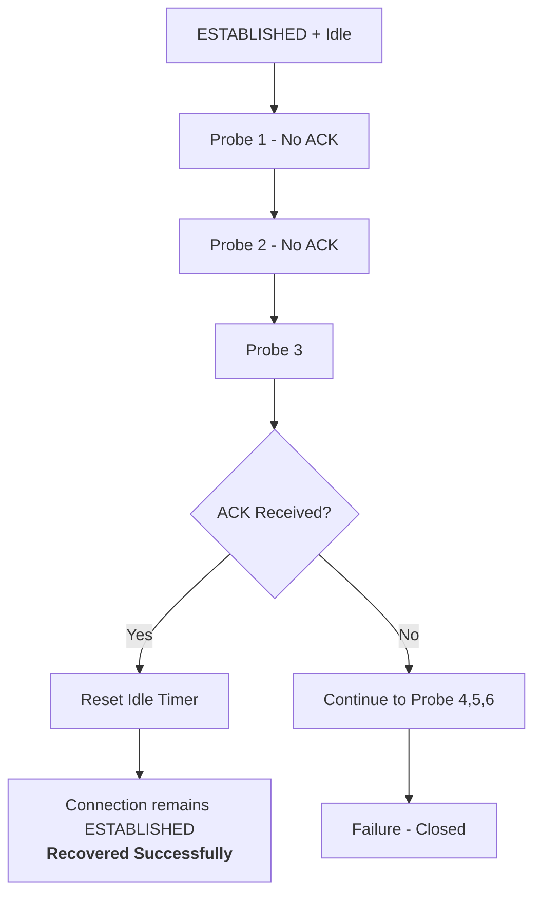
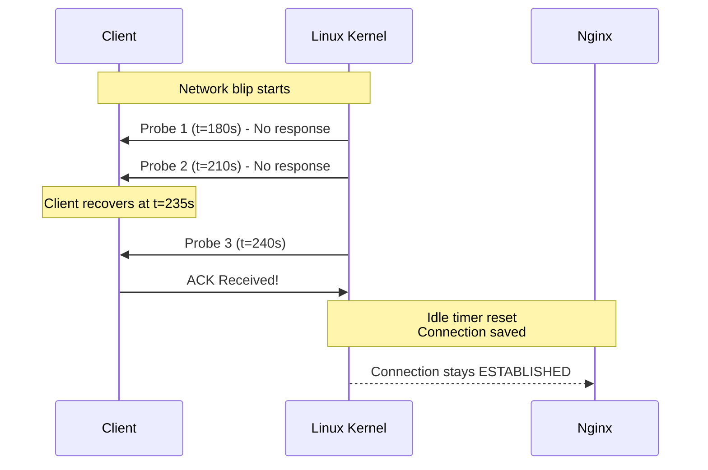

## Introduction

In production systems, especially Kubernetes environments with thousands of concurrent connections, silent failures and zombie sockets can quietly degrade performance and exhaust resources. 

The `so_keepalive` directive in Nginx is one of the most powerful yet underutilized tools to combat this. It operates at the **TCP socket level**, far below HTTP.

This extended guide provides a crystal-clear, professional explanation with detailed mechanics, real-world scenarios, connection state transitions, and **Mermaid diagrams** to visualize success, failure, and recovery paths.

---

## What is `so_keepalive`?

`so_keepalive` is a parameter of the `listen` directive that enables the Linux kernel’s `SO_KEEPALIVE` socket option on accepted connections.

```nginx
# Basic enable (uses system defaults)
listen 443 ssl so_keepalive=on;

# Custom values: keepidle:keepintvl:keepcnt
listen 80 so_keepalive=300:60:5;
```

**Parameters explained:**
- `keepidle`: Seconds of inactivity before first probe (e.g., 300 = 5 minutes)
- `keepintvl`: Seconds between retry probes (e.g., 60)
- `keepcnt`: Maximum probes before declaring the peer dead (e.g., 5)

---

## TCP Keepalive vs HTTP Keep-Alive

| Aspect                    | `so_keepalive` (TCP)                     | HTTP Keep-Alive                          |
|---------------------------|------------------------------------------|------------------------------------------|
| OSI Layer                 | Transport (Layer 4)                      | Application (Layer 7)                    |
| Purpose                   | Detect dead or unreachable peers         | Reuse TCP connection for multiple HTTP requests |
| Triggers on               | Pure inactivity (no data)                | After successful HTTP response           |
| Can detect crashes        | Yes                                      | No                                       |
| Direction in Nginx        | **Client → Nginx** (incoming)            | Both directions                          |
| Config location           | `listen` directive                       | `keepalive_timeout`, `keepalive_requests`, `upstream` block |

---

## TCP Keepalive Core Mechanics

When a connection is idle:

1. Kernel waits `keepidle` seconds.
2. Sends a TCP probe (packet with sequence number already acknowledged).
3. Expects an ACK from the client.
4. If ACK received → idle timer resets.
5. If no ACK → retries every `keepintvl` up to `keepcnt` times.
6. If all probes fail → kernel closes the socket and sends RST.

**TCP Connection States Involved:**
- `ESTABLISHED` → Normal idle state
- Remains `ESTABLISHED` during probing
- Transitions to `CLOSED` after `keepcnt` failures

---

## Scenario 1: Successful Keepalive (Healthy Idle Connection)

**Example Configuration:** `so_keepalive=300:60:5`

**Step-by-step flow:**

- t=0s: Client makes request. Connection = **ESTABLISHED**
- t=0s to t=300s: Connection idle
- t=300s: Kernel sends first keepalive probe
- Client responds with ACK immediately
- Idle timer **resets**
- Connection remains **ESTABLISHED** and healthy


```mermaid
flowchart LR
    A[Connection ESTABLISHED<br/>Idle starts] --> B[Wait 300s (keepidle)]
    B --> C[Send TCP Keepalive Probe]
    C --> D{ACK Received?}
    D -->|Yes| E[Reset Idle Timer]
    E --> F[Connection remains ESTABLISHED<br/>Healthy]
    D -->|No| G[Failure Path]
```

**Sequence Flow:**



---

## Scenario 2: Complete Failure (Dead Peer / Crashed Client)

**Example:** Client pod crashes or network partition.

**Step-by-step:**

- t=0s: Connection **ESTABLISHED**
- t=300s: First probe sent → No response
- t=360s: Second probe (after 60s)
- t=420s: Third probe
- t=480s: Fourth probe
- t=540s: Fifth probe
- t=540s + timeout: `keepcnt` (5) reached → Kernel closes socket
- Nginx receives error on next read/write → Connection closed

**Final result:** Socket moves from `ESTABLISHED` → `CLOSED`. Resources freed.

**Failure Flow:**



**Sequence Flow - Failure:**



---

## Scenario 3: Partial Failure → Recovery (Success After Few Attempts)

This is the most valuable real-world case — temporary network blips, garbage collection pauses, or flaky clients.

**Example:**
- `so_keepalive=180:30:6`

**Step-by-step:**

- t=0s: Connection **ESTABLISHED**
- t=180s: Probe 1 → No ACK (network blip)
- t=210s: Probe 2 → No ACK
- t=240s: Probe 3 → **Client recovers and sends ACK**
- Idle timer **resets**
- Connection stays **ESTABLISHED** — no disruption at application layer

**Recovery Flow:**



**Sequence Flow - Recovery:**



---

## `so_keepalive` in Kubernetes Context

**Recommended values in K8s:**
```nginx
so_keepalive=120:30:5   # Aggressive for cloud environments
```

**Application methods:**
- Custom NGINX Ingress Controller with modified template (`/etc/nginx/template/nginx.tmpl`)
- Using `server-snippet` + ConfigMap (limited for `listen`)
- Best: Run Nginx as a DaemonSet or use `tcp`/`udp` services for Layer 4

**Cannot be reliably applied when:**
- Using cloud Load Balancers that terminate TCP before reaching Nginx
- Service Mesh (Istio ambient or sidecar) overrides socket behavior
- Using `externalTrafficPolicy: Cluster` with certain CNIs

---

## Best Practices

1. Always set `so_keepalive` on public-facing listeners
2. Use more aggressive values in Kubernetes than bare metal
3. Monitor with:
   - `ss -o state established | grep -E 'keepalive'`
   - Prometheus metrics for `node_netstat_Tcp_ActiveOpens`
4. Combine with `keepalive_timeout 75s;` and `keepalive_requests 1000;`

---

## Final Conclusion

`so_keepalive` gives Nginx the ability to ask the kernel: *"Is this client still alive?"* — something HTTP Keep-Alive cannot do.

The visual flows above clearly show why it matters:

- **Success path**: Maintains healthy long-lived connections
- **Failure path**: Cleanly removes dead sockets
- **Recovery path**: Gracefully survives transient failures — the hallmark of resilient systems

In Kubernetes, where pods restart frequently and networks are dynamic, properly tuned `so_keepalive` is not optional — it is a **reliability requirement**.

Master these flows, configure it correctly, and you will significantly reduce "ghost connections," improve resource utilization, and build more observable, production-grade systems.
